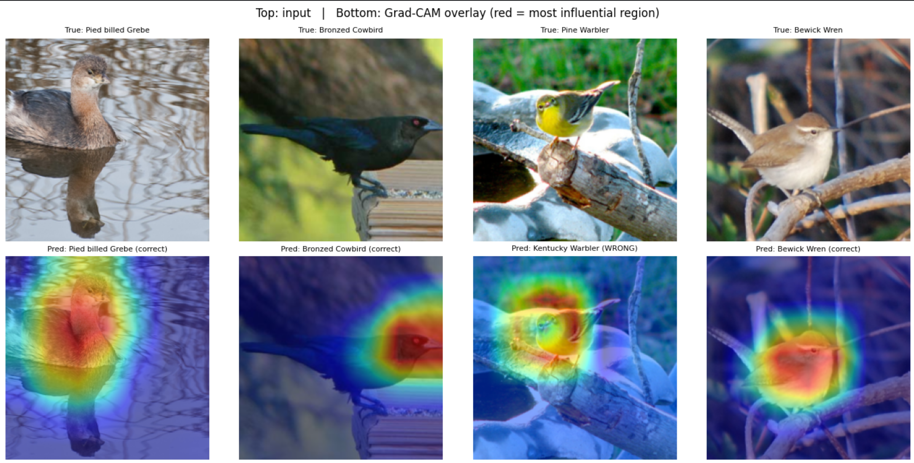

# Fine Grained CUB Classifier
Fine Tune EfficientNet to recognize the 200 bird species in the CalTech-UCSD Birds-200-2011 (CUB-200-2011) dataset, with transfer learning, traing/evaluation, and model interpretability (Grad-CAM + error analysis)

## What is done:

1. Loads **EfficientNet-B0** pretrained on ImageNet.
2. Replaces the final layer with a fresh 200-class head and **fine-tunes** it
   on CUB-200-2011 (transfer learning).
3. Trains with AdamW + cosine LR decay, tracking train/validation curves.
4. Evaluates **top-1 / top-5 accuracy** on the held-out test split.
5. Analyzes the model: a **confusion matrix** to find systematic errors and
   **Grad-CAM** heatmaps to verify what the model actually looks at.

   
## Results

| Metric | Value |
| --- | --- |
| Top-1 accuracy (test) | `79.38%` |
| Top-5 accuracy (test) | `95.79%` |
| Backbone | EfficientNet-B0 (ImageNet-pretrained) |
| Classes | 200 |
| Epochs | 10 (full fine-tune) |

## Error analysis
**Grad-CAM confirms the model attends to the bird, not the background.**
On correctly classified images, the heatmap concentrates on the bird's head
and body rather than surrounding water, branches, or foliage — evidence that
accuracy is *not* the result of a background shortcut (e.g. "water → grebe").
Misclassified images tend to show more diffuse, unfocused attention.

**Misclassifications cluster within taxonomic families.** The most-confused
class pairs are all visually similar species — the same distinctions expert
birders find difficult and often resolve by call rather than sight:

| Count | True species | Predicted as | Group |
| --- | --- | --- | --- |
| 12 | American Crow | Common Raven | corvids |
| 11 | Long-tailed Jaeger | Pomarine Jaeger | jaegers |
| 9 | Fish Crow | American Crow | corvids |
| 9 | Common Tern | Arctic Tern | terns |
| 9 | California Gull | Western Gull | gulls |
| 8 | Forster's Tern | Common Tern | terns |
| 8 | Elegant Tern | Caspian Tern | terns |
| 8 | Barn Swallow | Cliff Swallow | swallows |
| 8 | Arctic Tern | Common Tern | terns |
| 7 | Least Flycatcher | Acadian Flycatcher | *Empidonax* flycatchers |
| 7 | Great Grey Shrike | Loggerhead Shrike | shrikes |

**Worst-performing species** (lowest per-class accuracy, ~30 test images each):
California Gull (20%), Least Flycatcher (21%), Long-tailed Jaeger (33%),
Common Tern (33%), American Crow (37%), Fish Crow (37%). These belong to the
families ornithologists consider hardest to separate visually — gulls, terns,
and *Empidonax* flycatchers.

**Takeaway:** the confusions track genuine inter-species visual similarity, not
noise — indicating the model learned meaningful morphological features. The
remaining errors are best attributed to genuinely hard look-alike species and
limited per-class data (~30 images/class), not a flaw in the model. Likely
improvements: more data per class, or higher input resolution so fine plumage
details survive.

## Dataset

Wah, C., Branson, S., Welinder, P., Perona, P., Belongie, S.
*The Caltech-UCSD Birds-200-2011 Dataset.* Caltech Vision Lab, 2011.
[Dataset page](https://www.vision.caltech.edu/datasets/cub_200_2011/)
